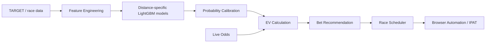

# KEIBA-AI / KAIBA

公開ポートフォリオ用にまとめた、競馬予測・期待値判定・自動投票までを一気通貫で扱う個人開発プロジェクトの概要です。

> このリポジトリは README 公開用です。運用コード、学習済みモデル、購入データ、認証情報は含めていません。

## 概要

TARGET / JRA-VAN 系データをもとに各馬の勝率と3着内確率を予測し、発走前オッズから期待値を計算して購入判断までつなぐ Python ベースのシステムを構築しました。  
単なる予想モデルではなく、以下をまとめて設計・実装しています。

- 特徴量生成
- 距離別モデル学習
- 確率キャリブレーション
- 発走前オッズ取得
- EV ベースの馬券選定
- スケジューラ連携
- ブラウザ自動操作による購入実行

## 技術的な見どころ

- 799個の特徴量を生成し、LightGBM を中心に距離別で学習
- Optuna によるハイパーパラメータ探索と seed bagging を導入
- 勝率だけでなく 3着内系の予測も分離し、券種ごとの判断に利用
- SmoothIsotonic 系のキャリブレーションで確率の歪みを補正
- 発走前オッズを取り込んで EV を再計算し、推奨と購入を直前更新
- オッズが取得できないケース向けに `no_odds` 系モデルを分離
- 推論から購入までを日付指定で回せるように CLI / scheduler 化
- smoke test と構成チェックを用意し、別 PC でも再現しやすい形に整理

## 担当したこと

- データ前処理と特徴量設計
- モデル学習パイプラインの設計
- バックテストと評価指標の整理
- 本番推論フローの実装
- 自動投票オーケストレーション
- ディレクトリ設計、設定管理、運用手順の文書化

## 評価結果

2026年3月14日時点の内部評価では、以下の結果を確認しています。

| 指標 | 値 |
|------|----|
| 総合テスト AUC | **0.8310** |
| 12ヶ月バックテスト ROI | **144.5%** |
| EV-Kelly 適用時 ROI | **171.6%** |
| 対象期間 | 2025年2月〜2026年1月 |
| 真の OOS 期間 | 2025年11月〜2026年1月 |

補足:

- flat stake は 100円固定で集計
- EV-Kelly は期待値に応じて賭け金を変動
- 一部券種の履歴評価には、データ制約上、確定後に得られるオッズを使って再構成した区間が含まれます
- そのため、実運用の回収率は保守的に見る必要があります

数値を大きく見せるより、評価条件の制約を明示したうえで公開することを重視しています。

## システム構成

## 主な技術スタック

- Python 3.13
- pandas / numpy
- scikit-learn
- LightGBM
- Optuna
- Playwright / Selenium
- Git / Git LFS

## 公開している範囲

この公開リポジトリでは、就職活動向けのポートフォリオとして以下のみを扱います。

- プロジェクト概要
- 設計方針
- 技術選定
- 評価結果の要約

以下は公開していません。

- 運用コード本体
- 学習済みモデル
- 有償データ由来の生データ
- 認証情報や自動購入設定
- そのまま再現可能な投票オペレーション詳細

## このプロジェクトで伝えたいこと

この開発で見せたいのは、モデル精度そのものだけではありません。

- 不完全な現実データを前提に、学習用と本番用のフローを分けて設計したこと
- モデル単体ではなく、予測から実行までの全体システムを組んだこと
- 数値が良いときも悪いときも、評価条件と制約を明示して意思決定したこと
- ローカルで回る個人開発でも、再現性と運用性を強く意識したこと

## 注意

- この README はポートフォリオ目的の公開資料です
- 馬券購入や投資判断を推奨するものではありません
- 実運用には金銭的リスクが伴います

## 公開資料の利用と報告

このリポジトリに含まれる説明資料は [MIT License](LICENSE) で公開しています。ここに含まれない非公開コード、学習済みモデル、元データの利用権を与えるものではありません。第三者の名称・商標・データには各権利者の条件が適用されます。

脆弱性や意図しない個人情報の公開に気付いた場合は、[SECURITY.md](SECURITY.md) の非公開窓口から報告してください。認証情報や実データを公開Issueへ添付しないでください。
